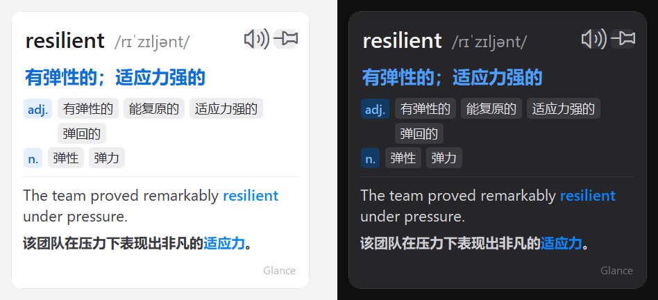

# Glance

**按住 Ctrl,鼠标指到哪个英文单词,就翻译哪个。** 一张 Apple 风格的圆角卡片贴着
光标弹出:音标、按词性分组的中文释义、整句翻译(原文和译文里的目标词同色高亮)。


- **全局取词,不挑软件**。浏览器、PDF、Word、聊天窗口、图片、视频字幕……只要
  屏幕上看得到,就能取词。原理是截图 + OCR,不依赖某个程序提供接口。
- **单词和句子一起翻**。卡片上半部分是这个词的音标和分词性释义,下半部分是它
  所在整句的翻译,一眼看懂词、也看懂上下文。
- **音标和词性离线可用**。内置 ECDICT 词典(约 24 万常用词),没网也能查词、看
  音标;整句翻译才需要联网。
- **不打扰**。默认要按住 Ctrl 才翻译,松开就消失;想留着看就点 📌 钉住。
- **顺手的小功能**:🔊 朗读、浅色 / 深色主题、开机自启、翻译来源一键切换。
- **绿色免安装**。一个 exe,双击即用,不写注册表,删掉就没了。

> ### 安装和使用
> 到 **[Releases](https://github.com/Joshuahu0129/Point-Translate-Glance/releases)**
> 下载： **`Glance.exe`** 一个文件,双击就能用
> 使用：用法和常见问题见 [docs/快速使用说明.md](docs/快速使用说明.md)。




## 快速开始

普通用户:下载 [最新 Release](https://github.com/Joshuahu0129/Point-Translate-Glance/releases)
里的 `Glance.exe`,双击运行。详见 [快速使用说明](docs/快速使用说明.txt)。

> 首次运行如提示缺少 OCR 语言包:设置 → 时间和语言 → 语言和区域 → English →
> 语言选项 → 安装「光学字符识别」,然后重启。

## 从源码运行 / 开发

需要 **Python 3.10 – 3.12**。

```bat
git clone https://github.com/Joshuahu0129/Point-Translate-Glance.git
cd Point-Translate-Glance
python -m venv .venv
.venv\Scripts\activate
pip install -r requirements.txt
python main.py
```

`glance-dict.db` 已随仓库提供。要自己重建(需 `pip install py7zr`):

```bat
python make_dict.py        REM 下载 ECDICT stardict.7z 并生成常用词子集
```

打包 exe:

```bat
pip install pyinstaller
build.bat                  REM 产物: dist\Glance.exe
```

## 代码结构

| 文件 | 作用 | 平台相关 |
|---|---|---|
| `main.py` | 编排:键鼠监听、取词、翻译、托盘 | DPI / 屏幕坐标(Win) |
| `ocr.py` | Windows 内置 OCR 封装 | **是**(Win) |
| `dictionary.py` | 离线 ECDICT(SQLite)查询 + 词性解析 | 否 |
| `translate.py` | 在线翻译引擎(google / mymemory) | 否 |
| `popup.py` | 卡片 UI、圆角、主题 | 圆角 / 图标字体(Win) |
| `tts.py` | 朗读单词 | **是**(Win) |
| `autostart.py` | 开机自启(注册表 Run 键) | **是**(Win) |
| `config.py` | 配置 + 版本号 | 否 |
| `make_dict.py` | 构建 `glance-dict.db`(开发用) | 否 |

Mac 版计划见 [docs/PORTING-MAC.md](docs/PORTING-MAC.md)。

## 配置(config.json)

与 exe 同目录,首次运行自动生成。改完在托盘点「重新加载配置」。

| 键 | 说明 | 默认 |
|---|---|---|
| `hotkey` | 按住的键:`ctrl` / `alt` / `shift` | `ctrl` |
| `translate_source` | 词义来源:`local`(词典) / `google` | `local` |
| `theme` | `light` / `dark` | `dark` |
| `target_language` | 目标语言 | `zh-CN` |
| `engine_order` | 整句翻译引擎顺序 | `["google","mymemory"]` |
| `card_width` / `corner_radius` / `font_size` / `opacity` | 卡片外观 | 380 / 16 / 12 / 1.0 |
| `capture_width` / `capture_height` | 取词截图区域 px | 1000 / 68 |
| `debounce_ms` / `linger_ms` | 静止多久查词 / 松键后停留 | 130 / 500 |
| `auto_speak` | 弹出时自动朗读 | `false` |

大陆网络访问不了 Google 时,把 `engine_order` 改成 `["mymemory"]`,或
`translate_source` 设为 `local` 并接受"整句仍需 Google"。

## 版本

当前 **1.0.0**,改动记录见 [CHANGELOG.md](CHANGELOG.md)。

## 致谢与许可

- 词典数据来自 [ECDICT](https://github.com/skywind3000/ECDICT)(MIT),见 [NOTICE](NOTICE)。
- 本项目使用 [MIT 许可](LICENSE)。
